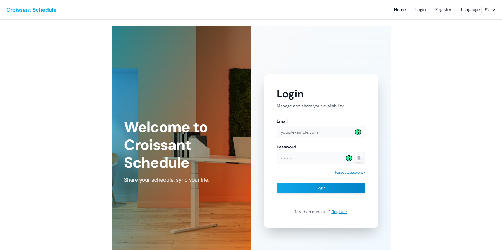
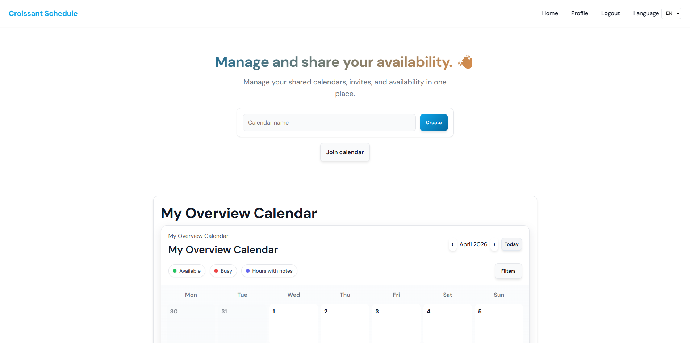
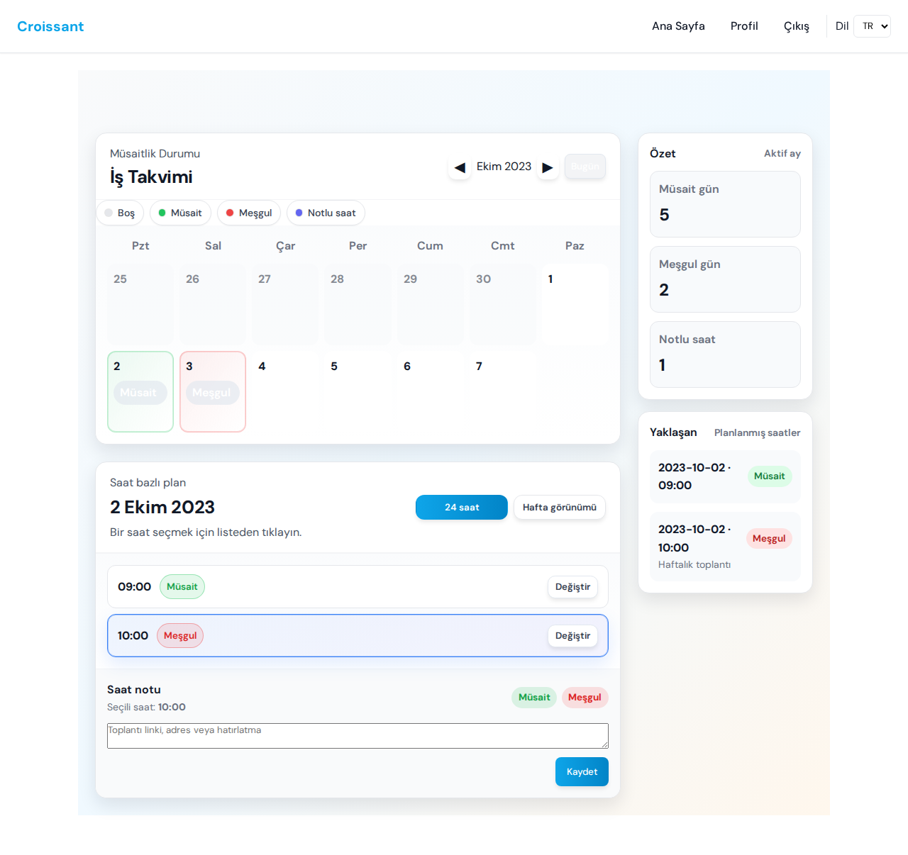
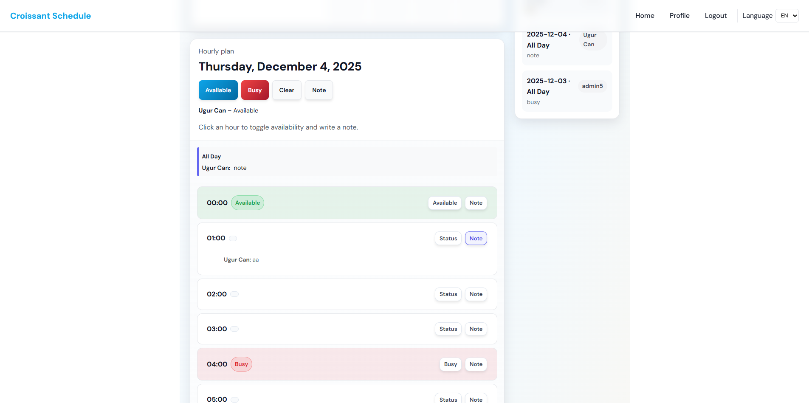

# Croissant Schedule

Live site: [croissant-schedule.com](https://croissant-schedule.com)

## English

Croissant Schedule is a shared availability app for small teams, friend groups, and collaborative projects. Users can create calendars, invite collaborators, mark day or hour-level availability, add notes, and manage access from one place.

### Screenshots

#### Login Experience

#### Dashboard and Overview Calendar

#### Shared Calendar View

#### Hourly Planning Detail

### Features

- User registration and login
- Shared calendars with invite codes
- Day and hour-based availability tracking
- Personal notes for time slots
- Profile management and password reset flow
- English, Spanish, French, and Turkish interface support

### Project Structure

- `index.php`: main PHP front controller and active app entrypoint
- `src/php/`: PHP config, database bootstrap, auth, helpers, and calendar logic
- `views/`: PHP templates
- `css/` and `js/`: frontend assets
- `src/server.js`: legacy Node/Express entrypoint kept for reference
- `init_users.php`: optional demo seed script for local development

### Requirements

- PHP 8+
- MariaDB or MySQL
- Node.js 18+ if you want to inspect the legacy Node layer
- SMTP credentials if you want the password reset email flow to work

### Environment Variables

Create a local `.env` or configure these variables in your hosting environment:

- `DB_HOST`
- `DB_NAME`
- `DB_USER`
- `DB_PASSWORD`
- `SMTP_HOST`
- `SMTP_PORT`
- `SMTP_USER`
- `SMTP_PASSWORD`
- `APP_BASE_PATH`
- `SESSION_SECRET`

See `.env.example` for safe placeholder values.

### Local Setup

1. Create a database and update the environment variables.
2. Serve the project with PHP so `index.php` is the document root entrypoint.
3. Open the app in your browser and register a user.
4. If you want demo data, run `php init_users.php` in a local environment after the database is configured.

## Türkçe

Croissant Schedule; küçük ekipler, arkadaş grupları ve birlikte çalışan projeler için geliştirilmiş paylaşımlı bir müsaitlik uygulamasıdır. Kullanıcılar takvim oluşturabilir, davet kodlarıyla kişi ekleyebilir, gün veya saat bazında müsaitlik işleyebilir, not bırakabilir ve erişimi tek bir yerden yönetebilir.

### Özellikler

- Kullanıcı kaydı ve giriş sistemi
- Davet koduyla paylaşılan takvimler
- Günlük ve saatlik müsaitlik takibi
- Saat aralıklarına özel not ekleme
- Profil yönetimi ve şifre sıfırlama akışı
- İngilizce, İspanyolca, Fransızca ve Türkçe arayüz desteği

### Proje Yapısı

- `index.php`: ana PHP giriş noktası ve aktif uygulama akışı
- `src/php/`: PHP config, veritabanı başlatma, auth, yardımcı fonksiyonlar ve takvim mantığı
- `views/`: PHP şablon dosyaları
- `css/` ve `js/`: arayüz dosyaları
- `src/server.js`: referans olarak korunan eski Node/Express katmanı
- `init_users.php`: yerel geliştirme için isteğe bağlı demo veri scripti

### Gereksinimler

- PHP 8+
- MariaDB veya MySQL
- Eski Node katmanını incelemek istersen Node.js 18+
- Şifre sıfırlama e-postalarının çalışması için SMTP bilgileri

### Ortam Değişkenleri

Yerelde bir `.env` dosyası oluşturabilir veya hosting ortamında şu değişkenleri tanımlayabilirsin:

- `DB_HOST`
- `DB_NAME`
- `DB_USER`
- `DB_PASSWORD`
- `SMTP_HOST`
- `SMTP_PORT`
- `SMTP_USER`
- `SMTP_PASSWORD`
- `APP_BASE_PATH`
- `SESSION_SECRET`

Güvenli örnek değerler için `.env.example` dosyasına bak.

### Yerel Kurulum

1. Bir veritabanı oluştur ve ortam değişkenlerini güncelle.
2. Projeyi `index.php` giriş noktası olacak şekilde PHP ile servis et.
3. Tarayıcıda uygulamayı aç ve bir kullanıcı hesabı oluştur.
4. Demo veri istersen veritabanı ayarlarından sonra yerel ortamda `php init_users.php` çalıştır.
